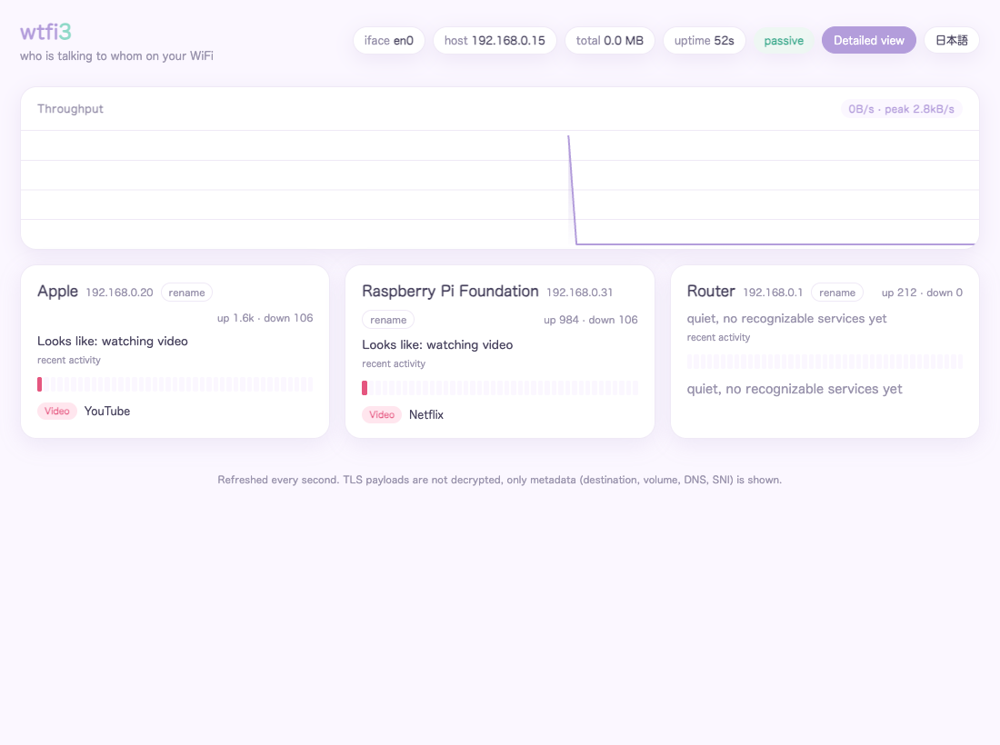
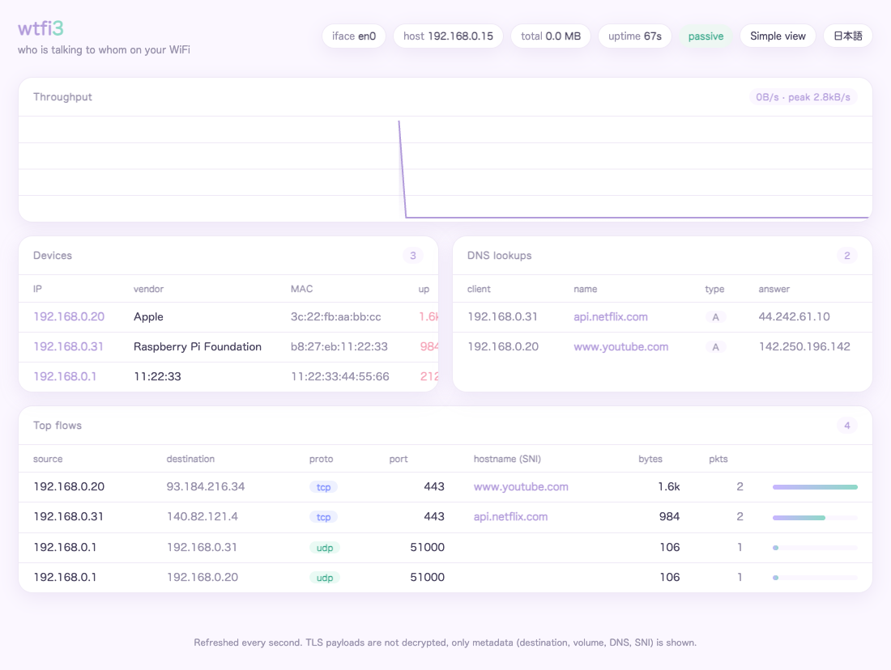

# wtfi3

[](https://github.com/kanywst/wtfi3/actions/workflows/ci.yml) [](https://github.com/kanywst/wtfi3/releases/latest) [](go.mod) [](LICENSE)

**wtfi3** は、自分が管理する WiFi ネットワーク上で「誰が誰と通信しているか」を可視化するツールです。自分のネットワークに接続し、バイナリを 1 つ実行してブラウザを開けば、各デバイスのフロー・DNS 名前解決・接続先ホスト名・帯域をリアルタイムに確認できます。

これは盗聴ツールではなくメタデータ可視化ツールです。TLS の中身は復号しません。得られるのは通信の「かたち」、つまり通信相手・通信量・プロトコル・DNS 名・TLS SNI ホスト名です。

[English README](README.md) · [TCP/IP 入門](docs/tcp-ip-primer.ja.md) · [仕組みの解説（ネットワーク内部）](docs/how-it-works.ja.md)

## スクリーンショット

かんたん表示は、各デバイスの通信を人間語のサービス名・活動にまとめ、その端末が何をしていたかのタイムラインも表示します:



くわしい表示は、生のデバイス・フロー上位・DNS を残します:



## 見えるもの

- **デバイス**: LAN 上の各ホストを IP・MAC・メーカー（埋め込みの IEEE OUI データベース由来）・上り/下りバイト数付きで一覧。
- **フロー上位**: 送信元から宛先、プロトコル、ポート、接続先ホスト名（SNI）、バイト数、パケット数。
- **DNS 名前解決**: どの端末がどの名前を解決し、応答が何だったか。
- **通信量**: 直近 2 分のライブ帯域グラフ。
- **新規デバイス通知**: wtfi3 が起動して落ち着いた後に参加した端末は、カードに `新規` バッジが付きヘッダにも件数が出るので、見慣れない端末の出現に気づけます。起動時点で既にいた端末はベースラインとして扱い、バッジは付きません。
- **接続中の Wi-Fi**: キャプチャ対象が無線インターフェースなら、SSID・BSSID をヘッダに表示し、macOS では暗号化なしの警告も出します（Linux で使う `iw` の出力には暗号方式が含まれないため、暗号化なし判定は当面 macOS のみ）。macOS 14 以降は SSID と BSSID が位置情報サービスの許可対象なので、許可のないプロセスでは名前の代わりに「非開示（位置情報の許可が必要）」と表示されます（接続の有無は正しく分かります）。
- **端末が通信しているトラッカー**: かんたん表示は、よくある解析・広告・アトリビューション・クラッシュレポート・IoT テレメトリのエンドポイントの運営者名を表示し（`app-measurement.com` を `Google Analytics`、`tuyaus.com` を `Tuya cloud` のように）、各端末が接続した異なるトラッカーの数も出します。ラベルは DNS/SNI からのみ判定し、TLS の中身は復号しません。

## 見えないもの

- **暗号化されたペイロード。** HTTPS/TLS の中身は暗号化されたままです。SNI/DNS から「YouTube を見ている」ことは分かりますが、どの動画かは分かりません。
- **MITM なしでの他端末の通信。** スイッチングされたネットワークでは、自分宛のユニキャストとブロードキャスト/マルチキャストしか届きません。他端末を見るには後述の `-spoof` が必要です。

ネットワークが初めてなら、まず [TCP/IP 入門](docs/tcp-ip-primer.ja.md) を読み、次に図解付きの詳細である [wtfi3 の仕組み](docs/how-it-works.ja.md) を参照してください。

## 必要要件

- `libpcap` が利用可能な macOS または Linux。
- ビルドに Go 1.25 以降。
- ライブキャプチャには root 権限（生パケットアクセス）。オフライン再生には不要。

## インストール

### Homebrew

```bash
brew install kanywst/tap/wtfi3
```

### ソースから

```bash
git clone https://github.com/kanywst/wtfi3.git
cd wtfi3
make build
```

Go ツールチェーンを直接使う場合:

```bash
go build -o wtfi3 ./cmd/wtfi3
```

## 使い方

```bash
# パッシブ: 自分の Mac のトラフィックとブロードキャスト/マルチキャストのみ。
sudo ./wtfi3 -i en0

# ARP スプーフ MITM: LAN をこのホスト経由に中継して全端末のフローを捕捉。
# -i-own-this-network の明示的な承認が必須。-spoof 単体では起動しない。
sudo ./wtfi3 -i en0 -spoof -i-own-this-network

# 生パケットを Wireshark 用に保存も行う。
sudo ./wtfi3 -i en0 -spoof -i-own-this-network -w capture.pcap

# 保存済みキャプチャのオフライン再生（root 不要）。
./wtfi3 -r capture.pcap
```

その後 <http://localhost:8080> を開きます。ヘッダーに表示トグルと言語トグル（既定は英語、日本語も選択可）があります。

- **かんたん表示**（既定）は、各デバイスの通信を DNS 名と TLS SNI から分類し、人間語のサービス名と活動カテゴリ（動画・買い物・メール・SNS・AI・検索・ニュース・地図・金融・フードなど）にまとめます。どの端末が何をしていて、どのサービスに繋いでいるかが一目で分かります。各端末にニックネームを付けられ、カードには直近1分の「最近の動き」タイムラインが表示されます。
- **くわしい表示**は、生のデバイス・フロー上位・DNS の表を表示します。

### フラグ

| フラグ | 既定値 | 意味 |
| --- | --- | --- |
| `-i` | `en0` | キャプチャするインターフェース。 |
| `-spoof` | `false` | LAN を ARP スプーフして他端末を捕捉。`-i-own-this-network` が必須。 |
| `-i-own-this-network` | `false` | 自分が所有または許可を得たネットワークであることの承認。`-spoof` に必須。 |
| `-w` | (無効) | 捕捉パケットをこの `.pcap` ファイルにも書き出す。 |
| `-r` | (無効) | ライブではなく `.pcap` ファイルから読み込む（root 不要）。 |
| `-listen` | `:8080` | ダッシュボードの待ち受けアドレス。 |
| `-scan` | (自動) | スプーフ時にスキャンする LAN CIDR を上書き。 |
| `-snaplen` | `262144` | キャプチャのスナップ長。 |
| `-version` | | バージョンを表示して終了。 |

## 法的・倫理的な利用について

ARP スプーフは能動的な中間者攻撃です。wtfi3 は既定でパッシブであり、`-spoof` は `-spoof` と明示的な `-i-own-this-network` 承認の両方を渡さない限り無効のままなので、フラグの渡し間違いで起動することはありません。自分が所有するか明示的な書面による許可を得たネットワークでのみ実行してください。管理外のネットワークでの通信傍受は多くの法域で違法です。作者は誤用について一切の責任を負いません。

## 開発

```bash
make test         # 単体テスト
make lint         # golangci-lint 実行
make build        # バージョン埋め込みビルド

# オフラインテスト用の合成キャプチャを再生成:
go run hack/gensample.go /tmp/sample.pcap
./wtfi3 -r /tmp/sample.pcap

# 埋め込み MAC-ベンダ DB (web/oui.tsv) を更新:
hack/update-oui.sh
```

コミット規約とリリース手順は [CONTRIBUTING.md](CONTRIBUTING.md) を参照してください。

## ライセンス

[MIT](LICENSE)
