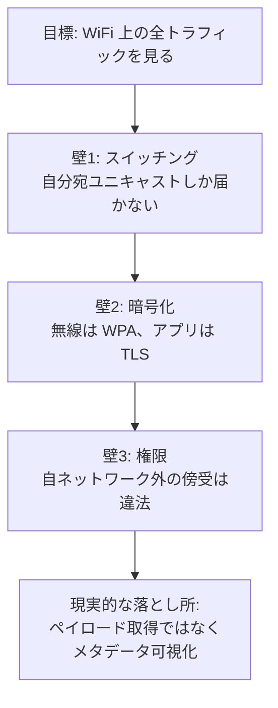
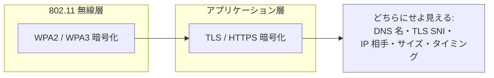
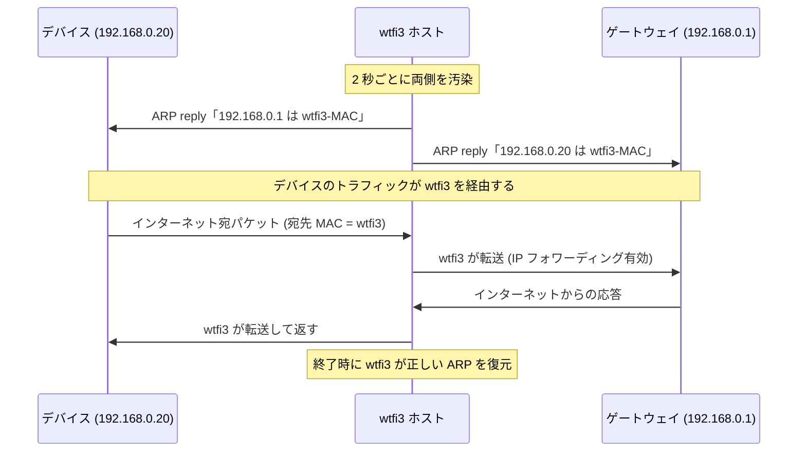
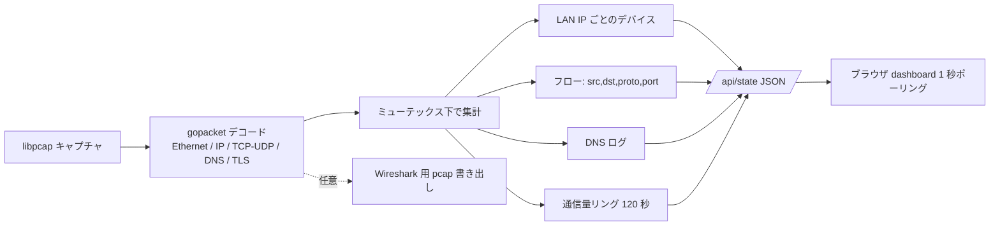
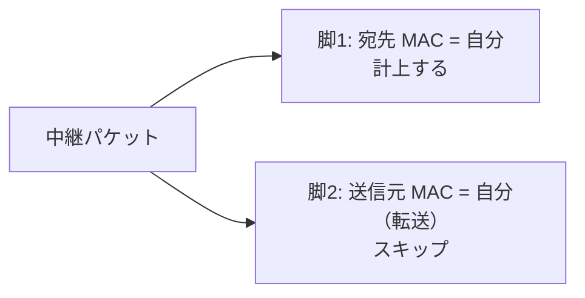

# 仕組みの解説

このドキュメントでは wtfi3 の背後にあるネットワークの仕組みを説明します。「全部キャプチャする」が
なぜ聞こえほど簡単ではないのか、wtfi3 がそれにどう対処するのか、そして何が見えて何が見えないのかを
正確に述べます。

[English version](how-it-works.md)

## 3 つの壁

「WiFi 上の全トラフィックをキャプチャする」には 3 つの壁があります。これを理解しているかどうかが、
実際に機能するツールと、自分のノート PC のトラフィックしか映らないツールとの分かれ目です。

### 壁 1 — スイッチング

現代の WiFi アクセスポイントやスイッチはハブではありません。ユニキャストフレームは宛先のポートや
無線にだけ転送されます。したがって NIC が既定で受け取るのは次のものです。

- 自分宛のトラフィック（自分のダウンロード・アップロード）
- ブロードキャストフレーム（ARP・DHCP・mDNS・SSDP）
- 参加しているマルチキャストフレーム

他のデバイスとゲートウェイの間のユニキャストは **届きません**。よって単純な `tcpdump` ではその
ノート PC のトラフィックしか見えません。他デバイスを見るには、そのトラフィックを物理的に自分の
インターフェースへ到達させる必要があり、それを行うのが ARP スプーフです（後述）。

### 壁 2 — 暗号化（2 層）

フレームが届いたとしても、一般的なネットワークではバイト列が二重に暗号化されています。

| 層 | 暗号 | 読めるか？ |
| --- | --- | --- |
| 802.11 無線 | WPA2 | PSK と各端末の 4-way ハンドシェイク捕捉があれば可能。 |
| 802.11 無線 | WPA3 (SAE) | 実質不可 — セッションごとの前方秘匿性。 |
| アプリ | TLS / HTTPS | 不可。ただし SNI・DNS・宛先 IP・通信量・タイミングはメタデータとして漏れる。 |

wtfi3 は無線層の復号を試みません。WiFi で実行する時点で既にネットワークに接続済みなので、OS は
復号済みの 802.11 フレームを通常の Ethernet フレームとして渡してくれます。TLS のペイロードは
暗号化されたままで、wtfi3 は復号を一切試みません。平文で露出しているメタデータだけを読み取ります。

### 壁 3 — 権限

ARP スプーフは能動的な中間者攻撃です。自分が所有するか明示的に許可されたネットワークでのみ合法です。
wtfi3 の `-spoof` モードは、自分が管理する家庭内やラボのネットワークを想定しています。

## キャプチャモード

wtfi3 は壁 1 と壁 3 に対応した 2 つのキャプチャ戦略を提供します。

### パッシブモード

`sudo ./wtfi3 -i en0` はインターフェースをプロミスキャスモードで開き、届いたものをそのまま読みます。
つまり自分のトラフィックとブロードキャスト/マルチキャストです。完全に非侵襲的です。他デバイスの
存在はブロードキャスト（ARP・mDNS）から検出できますが、そのユニキャストフローは見えません。

### スプーフモード（ARP MITM）

`sudo ./wtfi3 -i en0 -spoof` は ARP キャッシュを汚染して、各 LAN デバイスとゲートウェイの間に
このホストを割り込ませます。これによりトラフィックが自機を経由し、キャプチャできるようになります。

これを機能させるため、wtfi3 は稼働中に IP フォワーディング（macOS では
`net.inet.ip.forwarding=1`）を有効化し、終了時に元へ戻します。さらに終了時に訂正 ARP を送出して
ネットワークをきれいに復旧させます。

## wtfi3 が各パケットで行うこと

内部的には、単一のキャプチャループが集計器へ流し込み、ダッシュボードが HTTP でスナップショットを
読み取る構成です。

- **デバイスの帰属は MAC ではなく IP で行います。** MITM 下ではデバイスのダウンロードフレームの
  L2 MAC が wtfi3 ホストに書き換わるため、MAC ベースの集計だと誤帰属します。LAN IP アドレスで
  デバイスを識別することで、両モードで正しく帰属できます。MAC（メーカー判定用）は ARP と、
  デバイスが直接送出するフレームから学習します。
- **メーカー判定** には埋め込みの IEEE OUI データベース（`web/oui.tsv`、約 52k プレフィックス）を
  使用します。ローカル管理 / ランダム化 MAC は推測せずフラグ表示します。
- **ホスト名** は 2 つの情報源から取得します。DNS 応答（名前と応答）と、ポート 443/8443 の
  TLS ClientHello の SNI フィールドです。

### スプーフモードでの二重計上の回避

wtfi3 がパケットを中継すると、同じペイロードが 2 回線上に現れます。1 回は wtfi3 ホストへの受信、
もう 1 回は転送コピーの送信です。両方数えるとバイトもパケットも 2 倍になってしまいます。

スプーフモードでは、L2 宛先が wtfi3 ホストである脚だけを計上するため、各中継パケットはちょうど
1 回だけ数えられます。パッシブモードでは転送がないため、すべてのフレームを計上します。

## 可視性のまとめ

| 質問 | 答え |
| --- | --- |
| ネットワーク上にどんなデバイスがいるか？ | 可 — IP・MAC・メーカー。 |
| 各デバイスがどれだけ転送しているか？ | 可 — 上り/下りバイト、ライブ通信量。 |
| 各デバイスの通信相手は？ | 可 — 宛先 IP とフロー。 |
| どのサイト/サービスか？ | 可 — DNS 名と TLS SNI 経由。 |
| トラフィックの実際の中身は？ | 不可 — TLS ペイロードは復号しない。 |
| スプーフなしで他デバイスは？ | 不可 — スイッチングにより無理。`-spoof` を使う。 |
