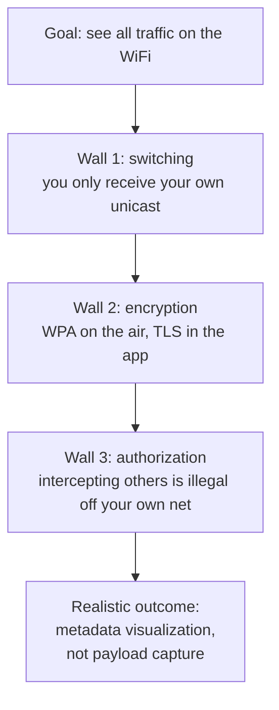
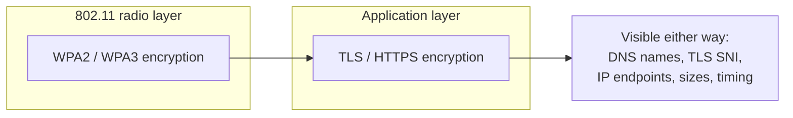
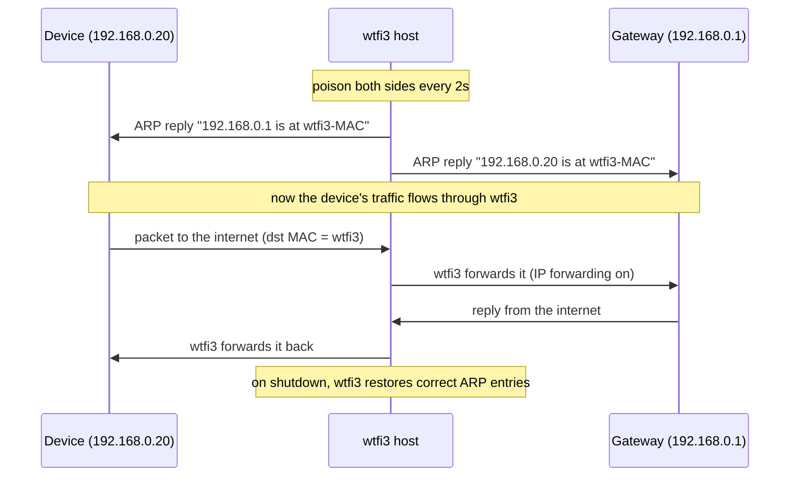
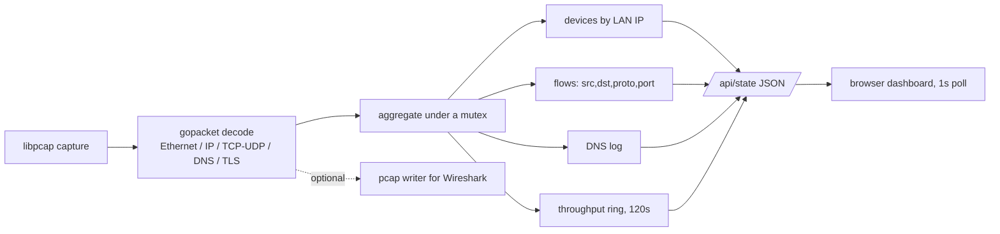
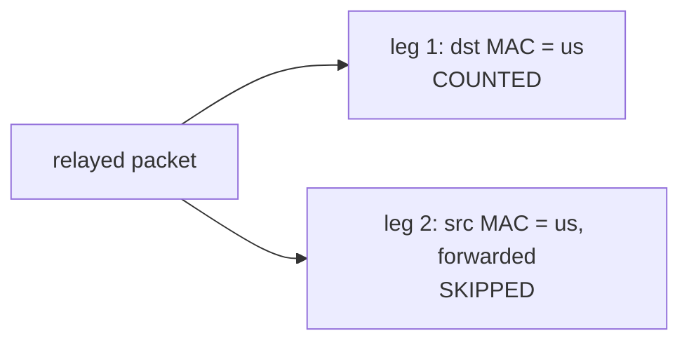

# How it works

This document explains the network mechanics behind wtfi3: why "just capturing
everything" is harder than it sounds, what wtfi3 does about it, and exactly what
is and is not visible.

[日本語版](how-it-works.ja.md)

## The three walls

Capturing "all the traffic on a WiFi network" runs into three walls. Understanding
them is the difference between a tool that works and one that only ever shows your
own laptop's traffic.

### Wall 1 — switching

Modern WiFi access points and switches are not hubs. They forward a unicast frame
only to the port or radio of its intended recipient. Your network card therefore
receives, by default:

- traffic addressed to you (your own downloads and uploads),
- broadcast frames (ARP, DHCP, mDNS, SSDP),
- multicast frames you have joined.

It does **not** receive the unicast traffic between other devices and the gateway.
So a naive `tcpdump` on a laptop shows only that laptop's traffic. To see other
devices, you must get their traffic to physically arrive at your interface — which
is what ARP spoofing does (below).

### Wall 2 — encryption (two layers)

Even once frames reach you, the bytes are encrypted twice on a typical network.

| Layer | Cipher | Can it be read? |
| --- | --- | --- |
| 802.11 radio | WPA2 | Only with the PSK and the captured 4-way handshake per device. |
| 802.11 radio | WPA3 (SAE) | Practically no — forward secrecy per session. |
| Application | TLS / HTTPS | No. But SNI, DNS, destination IP, volume, and timing leak as metadata. |

wtfi3 does not attempt radio-layer decryption. When you run it over WiFi you are
already associated to the network, so the OS hands you decrypted 802.11 frames as
ordinary Ethernet frames. TLS payloads remain encrypted, and wtfi3 never tries to
decrypt them. It reads only the metadata that is exposed in the clear.

### Wall 3 — authorization

ARP spoofing is an active man-in-the-middle attack. It is legal only on networks
you own or are explicitly authorized to test. wtfi3's `-spoof` mode is built for a
home or lab network you control.

## Capture modes

wtfi3 offers two capture strategies matched to walls 1 and 3.

### Passive mode

`sudo ./wtfi3 -i en0` opens the interface in promiscuous mode and reads whatever
arrives: your own traffic plus broadcast/multicast. This is completely non-invasive.
You will still discover other devices from their broadcast chatter (ARP, mDNS), but
you will not see their unicast flows.

### Spoof mode (ARP MITM)

`sudo ./wtfi3 -i en0 -spoof` inserts this host between every LAN device and the
gateway by poisoning ARP caches, so their traffic transits your machine and can be
captured.

For this to work, wtfi3 enables IP forwarding (`net.inet.ip.forwarding=1` on macOS)
while running and restores it on exit. It also sends corrective ARP replies on
shutdown so the network heals cleanly.

## What wtfi3 does with each packet

Internally the pipeline is a single capture loop feeding an aggregator, with the
dashboard reading a snapshot over HTTP.

- **Device attribution is by IP, not MAC.** Under MITM the layer-2 MAC on a
  device's download frames is rewritten to the wtfi3 host, so MAC-based accounting
  would misattribute traffic. Keying devices on the LAN IP address keeps
  attribution correct in both modes. The MAC (for vendor lookup) is learned from
  ARP and from frames a device sources directly.
- **Vendor lookup** uses the embedded IEEE OUI database (`web/oui.tsv`, ~52k
  prefixes). Locally administered / randomized MACs are flagged rather than guessed.
- **Hostnames** come from two sources: DNS responses (name to answer) and the SNI
  field of TLS ClientHello messages on ports 443/8443.

### Avoiding double counting in spoof mode

When wtfi3 relays a packet, the same payload appears on the wire twice: once
inbound to the wtfi3 host, once outbound as the forwarded copy. Counting both would
double every byte and every packet.

In spoof mode wtfi3 counts only the leg whose layer-2 destination is the wtfi3
host, so each relayed packet is counted exactly once. In passive mode there is no
forwarding, so every frame is counted.

## Summary of visibility

| Question | Answer |
| --- | --- |
| Which devices are on the network? | Yes — IP, MAC, vendor. |
| How much is each device transferring? | Yes — up/down bytes, live throughput. |
| Who is each device talking to? | Yes — destination IPs and flows. |
| Which websites/services? | Yes — via DNS names and TLS SNI. |
| The actual content of the traffic? | No — TLS payloads are never decrypted. |
| Other devices without spoofing? | No — switching prevents it; use `-spoof`. |
