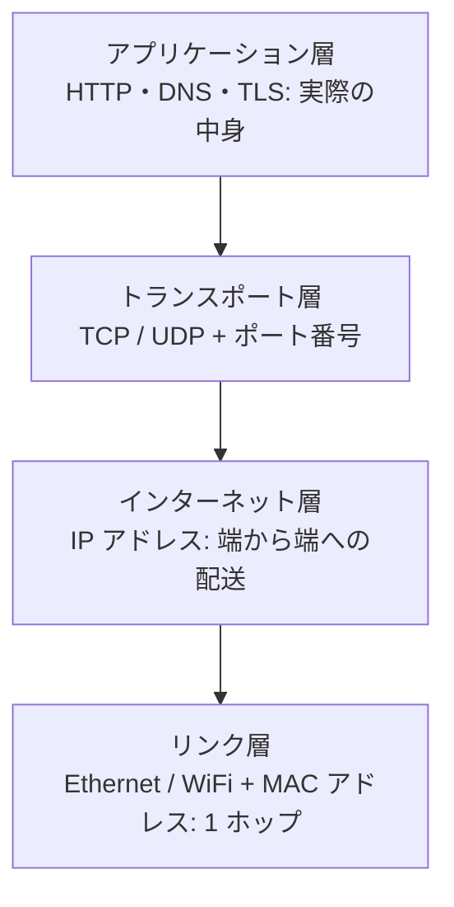
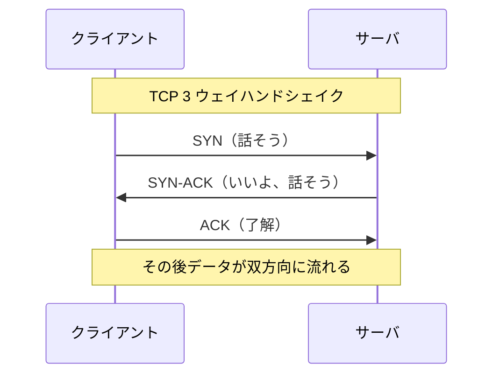
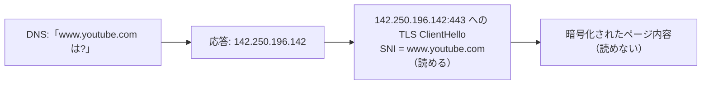
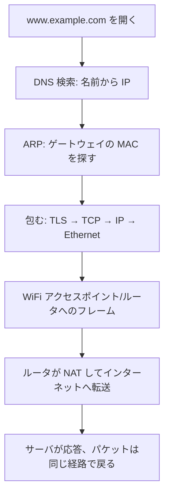

# TCP/IP 入門

これはネットワークを学んだことがない読者向けに、ネットワークがどうやってデータを運ぶのかをゼロから説明するものです。読み終える頃には、wtfi3 のダッシュボードで使われる用語（MAC、IP、ポート、TCP、UDP、DNS、SNI）が理解でき、なぜ見えるものと見えないものがあるのかが分かります。読み終えたら [wtfi3 の仕組み](how-it-works.ja.md) へ進んでください。

[English version](tcp-ip-primer.md)

## 一番大事な考え方: データは封筒の中の封筒で運ばれる

スマホが Web ページを読み込むとき、データは 1 本の長い流れとして運ばれるのではありません。**パケット**という小さな塊に分割されます。各パケットは何重ものラベルで包まれます。封筒の中に封筒、その中にまた封筒、というイメージです。それぞれの層が 1 つの問いに答えます。

- このローカルなケーブル/無線上で、次に受け取るべきマシンはどれか？（リンク層）
- インターネット全体で見て、最終的な宛先マシンはどれか？（インターネット層）
- そのマシン上のどのプログラムが受け取るべきか？（トランスポート層）
- 実際のバイト列は何を意味するか？（アプリケーション層）

この 4 つの問いの積み重ねが TCP/IP モデルです。

送信時は上から下へ包み（アプリのデータにトランスポートのヘッダ、次に IP のヘッダ、次にリンクのヘッダ）、受信時は下から上へ開きます。wtfi3 はパケット全体を捕捉し、これを開いてラベルを読み取ります。

## 第 1 層: リンク層（MAC アドレス）

リンク層はパケットを **1 ホップ**だけ運びます。ノート PC から WiFi アクセスポイントまで、あるいは同じ家庭内ネットワーク上の 2 台の間、といった単位です。各ネットワークインターフェースには `3c:22:fb:aa:bb:cc` のような 48 ビットの **MAC アドレス**が焼き込まれています。前半はメーカー（OUI）を表し、これが wtfi3 がデバイスの横に「Apple」や「Raspberry Pi」と表示できる理由です。

リンク層のパケットは**フレーム**と呼ばれます。送信元 MAC と宛先 MAC を持ちます。重要なのは、MAC アドレスはローカルネットワーク上でしか意味を持たず、ホップごとに書き換えられるという点です。

### ARP: IP に対応する MAC を見つける

デバイスは互いの IP アドレスは知っていますが、実際にフレームを送るには宛先の MAC が必要です。**ARP**（Address Resolution Protocol）はその検索です。あるデバイスが「192.168.0.1 は誰？」と叫び、持ち主が「それは私、この MAC です」と応答します。応答はキャッシュされます。この単純で疑うことを知らない仕組みこそ、ARP スプーフが悪用するものです（wtfi3 のドキュメント参照）。

## 第 2 層: インターネット層（IP アドレス）

インターネット層は、`192.168.0.20`（家庭内のプライベートアドレス）や `142.250.196.142`（Google のサーバ）のような **IP アドレス**を使い、最終的なマシンまで多数のホップを越えてパケットを配送します。この層のパケットは **IP パケット**と呼ばれ、端から端まで変わらない送信元 IP と宛先 IP を持ちます（MAC と違う点です）。

家庭内ネットワークはプライベート範囲（一般に `192.168.x.x`）を使います。ルータは **NAT**（Network Address Translation）で 1 つのグローバル IP を全デバイスで共有します。wtfi3 はデバイスをそのプライベート LAN IP で識別します。これは自ネットワーク内で安定しています。

## 第 3 層: トランスポート層（ポート、TCP、UDP）

1 台のマシンは同時に多数のプログラム（ブラウザ、メール、ゲーム）を動かします。**ポート番号**はパケットがどのプログラム宛かを示します。Web サーバは HTTPS を待つポート 443、DNS サーバはポート 53 で待ち受けます。フローは通常 `送信元 IP:ポート -> 宛先 IP:ポート` として要約されます。

主なトランスポートプロトコルは 2 つあります。

- **TCP** は信頼性のある順序付き会話です。ハンドシェイクで接続を確立し、失われたパケットを再送し、データを順番に並べ直します。Web とほとんどのアプリが使います。
- **UDP** は投げっぱなしです。ハンドシェイクも保証もなく、オーバーヘッドが小さい。DNS 検索や動画/音声がよく使います。

wtfi3 はパケットを、送信元・宛先・プロトコル・宛先ポートをキーにフローへまとめ、各フローのバイト数とパケット数を合算します。

## 第 4 層: アプリケーション層（DNS、HTTP、TLS、SNI）

ここでバイト列が意味を持ちます。wtfi3 にとって最も重要なアプリケーションプロトコルは 2 つです。

**DNS** は `www.youtube.com` のような名前を IP アドレスに変換します。デバイスが DNS サーバに問い合わせ、応答にアドレスが入ります。従来の DNS は暗号化されていないため、wtfi3 はデバイスがどの名前を引いたかを読めます。（デバイスが暗号化 DNS、DoH や DoT を使うと、これは見えなくなります。）

**HTTPS = HTTP + TLS。** TLS は Web トラフィックを暗号化し、途中の誰にも中身を読ませません。しかし TLS 接続の開始時、クライアントは接続したいサイト名を **ClientHello** の **SNI**（Server Name Indication）というフィールドで送ります。SNI はサーバがどの証明書を提示すべきか判断できるよう平文で送られます。これが、暗号化されたページのバイトを 1 つも読めないのに wtfi3 が宛先として `www.youtube.com` を表示できる理由です。

## まとめ: 1 回の Web リクエスト

## これが wtfi3 にとって何を意味するか

- **MAC と OUI**: wtfi3 は各デバイスに名前を付け、メーカーを推定する。リンク層。
- **IP**: wtfi3 は各デバイスとフローをアドレスでキーにする。インターネット層。
- **ポートと TCP/UDP**: wtfi3 は各フローのプロトコルと宛先ポートを表示する。トランスポート層。
- **DNS と SNI**: wtfi3 は何も復号せずに宛先ホスト名を復元する。アプリケーション層のメタデータ。
- **暗号化ペイロード**: 実際の中身は封じられたまま。wtfi3 は決して開かない。

各層が理解できたら、[wtfi3 の仕組み](how-it-works.ja.md) を読み、スイッチング・暗号化・権限が実際に捕捉できるものをどう形づくるかを確認してください。
