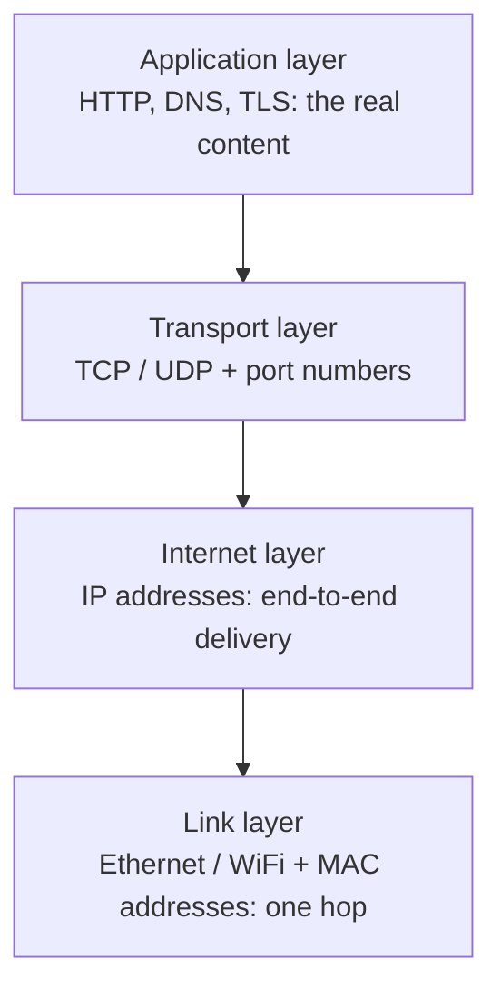
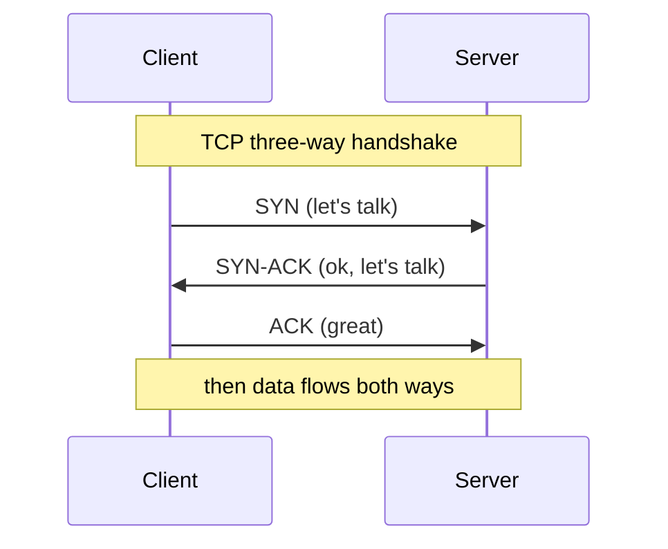
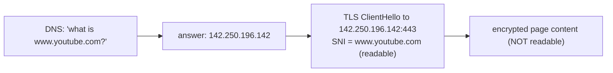
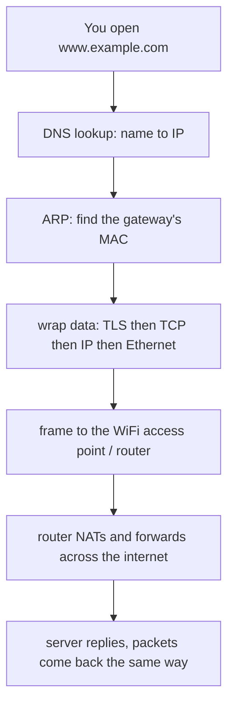

# TCP/IP primer

This is a from-scratch explanation of how a network moves data, written for readers who have never studied networking. By the end you will understand the words wtfi3 uses on its dashboard (MAC, IP, port, TCP, UDP, DNS, SNI) and why it can see some things but not others. When you are done, read [how wtfi3 works](how-it-works.md).

[日本語版](tcp-ip-primer.ja.md)

## The one big idea: data travels in envelopes inside envelopes

When your phone loads a web page, the data does not travel as one long stream. It is chopped into small chunks called **packets**. Each packet is wrapped in a series of labels, like an envelope inside an envelope inside an envelope. Each layer of wrapping answers one question:

- Which machine on this local cable/radio should grab this next? (the link layer)
- Which machine on the whole internet is the final destination? (the internet layer)
- Which program on that machine should receive it? (the transport layer)
- What do the actual bytes mean? (the application layer)

This stack of four questions is the TCP/IP model.

Sending wraps top to bottom (application data gets a transport header, then an IP header, then a link header). Receiving unwraps bottom to top. wtfi3 captures whole packets and unwraps them to read the labels.

## Layer 1: the link layer (MAC addresses)

The link layer moves a packet across **one hop**: from your laptop to the WiFi access point, or between two devices on the same home network. Every network interface has a burned-in 48-bit **MAC address** like `3c:22:fb:aa:bb:cc`. The first half identifies the manufacturer (the OUI), which is how wtfi3 shows "Apple" or "Raspberry Pi" next to a device.

A link-layer packet is called a **frame**. It carries a source MAC and a destination MAC. Crucially, MAC addresses only have meaning on the local network. They are rewritten at every hop.

### ARP: finding a MAC for an IP

Devices know each other's IP addresses, but to actually send a frame they need the destination's MAC. **ARP** (Address Resolution Protocol) is the lookup: a device shouts "who has 192.168.0.1?" and the owner replies "that's me, at this MAC". The answer is cached. This simple, trusting mechanism is exactly what ARP spoofing abuses (see the wtfi3 doc).

## Layer 2: the internet layer (IP addresses)

The internet layer delivers a packet across many hops, all the way to the final machine, using **IP addresses** like `192.168.0.20` (a private home address) or `142.250.196.142` (a Google server). The packet at this layer is called an **IP packet** and carries a source IP and a destination IP that stay the same end to end (unlike MACs).

Your home network uses a private range (commonly `192.168.x.x`). Your router does **NAT** (Network Address Translation) to share one public IP with all your devices. wtfi3 identifies devices by their private LAN IP, which is stable on your network.

## Layer 3: the transport layer (ports, TCP, UDP)

One machine runs many programs at once (a browser, a mail app, a game). **Port numbers** say which program a packet is for. A web server listens on port 443 for HTTPS; a DNS server listens on port 53. A flow is usually summarized as `source IP:port -> destination IP:port`.

There are two main transport protocols:

- **TCP** is a reliable, ordered conversation. It sets up a connection with a handshake, re-sends lost packets, and puts data back in order. Web and most apps use it.
- **UDP** is fire-and-forget: no handshake, no guarantees, lower overhead. DNS lookups and video/voice often use it.

wtfi3 groups packets into flows keyed by source, destination, protocol, and destination port, and sums the bytes and packet counts for each.

## Layer 4: the application layer (DNS, HTTP, TLS, SNI)

This is where the bytes mean something. Two application protocols matter most for wtfi3:

**DNS** turns a name like `www.youtube.com` into an IP address. Your device asks a DNS server, and the reply contains the address. Because classic DNS is unencrypted, wtfi3 can read which names a device looked up. (If a device uses encrypted DNS, DoH or DoT, this becomes invisible.)

**HTTPS = HTTP + TLS.** TLS encrypts the web traffic so nobody in the middle can read the content. But when a TLS connection starts, the client sends a **ClientHello** that names the site it wants, in a field called **SNI** (Server Name Indication). The SNI is sent in the clear so the server knows which certificate to present. That is why wtfi3 can show `www.youtube.com` as a destination even though it cannot read a single byte of the encrypted page.

## Putting it together: one web request

## What all this means for wtfi3

- **MAC and OUI**: wtfi3 names each device and guesses its vendor. Link layer.
- **IP**: wtfi3 keys each device and flow by address. Internet layer.
- **Port and TCP/UDP**: wtfi3 labels each flow's protocol and destination port. Transport layer.
- **DNS and SNI**: wtfi3 recovers destination hostnames without decrypting anything. Application layer metadata.
- **Encrypted payload**: the actual content stays sealed. wtfi3 never opens it.

Now that the layers make sense, read [how wtfi3 works](how-it-works.md) to see how switching, encryption, and authorization shape what is actually capturable.
